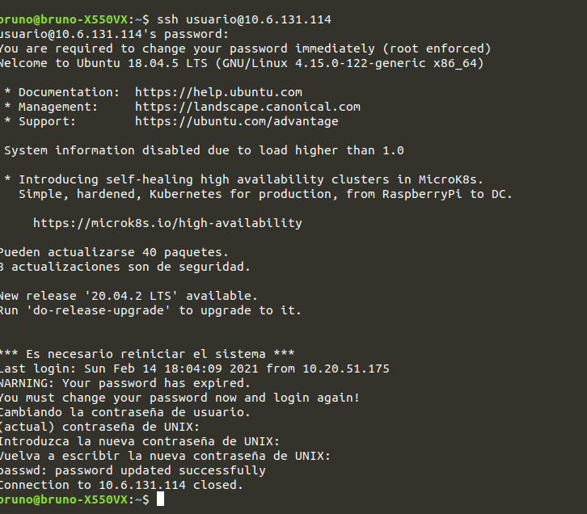

# Informe Práctica 1. Configuración de máquina virtual en el IaaS
## 1. Introducción

Informe de la primera práctica de la asignatura de **Desarrollo de Sistemas Informáticos**. En la práctica propuesta se ha realizado la configuración inicial de la **máquina virtual** otorgada mediante el **IaaS**, así cómo la posterior instalación de **git** y **Node.js**, además de configurar la **máquina local** para agilizar la conexión rémota entre ambas máquinas, y con el GitHub asociado al correo institucional. A su vez, aprender a utilizar el lenguaje de marcas **Markdown** y **GitHub Pages**.

## 2. Objetivos

El objetivo principal de la práctica es la preparación del entorno de trabajo de la asignatura. Para conseguirlo se tienen los siguientes objetivos:

* Aprender a conectarse a la **VPN de la ULL**, así cómo acceder al Iaas de la ULL.
* Saber realizar una conexión rémota mediante **SSH**.
* Configuración inicial de la máquina virtual.
* Configuración inicial de la máquina local.
* Manejo de **claves SSH**.
* Configuración de del **prompt** del la máquina virtual.
* Instalación de git y Node en la máquina virtual.
* Utilización del lenguaje de marcas Markdown.
* Utilización de la herramienta GitHub Pages.

## 3. Desarrollo

### 3.1 Tareas Previas

Para el desarrollo de la práctica cómo tal primero hay que hacer unas preparaciones previas, cumplimentar las encuestas de elección de trabajo y la de expectativas y conocimientos, darse de alta en el Google Classroom, así cómo solicitar los beneficios de estudiantes de GitHub Education con nuestro GitHub asociado del correo institucional, darnos de alta en el GitHub Classroom así cómo la asignación para obtener el repositorio para la práctica 1.

Cuando ya tengamos el repositorio de la práctica 1, necesitaremos saber manejarnos con el lenguaje de marcas Markdown y aprender a crear un GitHub Pages, Las siguientes guias son muy útiles, [Introducción a Markdown](https://guides.github.com/features/mastering-markdown/) y [GitHub Pages](https://docs.github.com/en/github/working-with-github-pages). Igualmente, para crear una Page de GitHub antes necesitamos tener archivos en nuestro repositorio, empezaremos creando un README.md para explicar la función del repositorio y un index.md dentro de una carpeta llamada docs en donde pondremos todo el contenido que cogerá GitHub Pages para la presentación del informe. Con esto, nos dirigmos a Settings y nos vamos a al apartado de GitHub Pages, aquí escogemos cómo Branch nuestro main, le damos a guardar y escogemos como carpeta /docs, con esto ya abremos creado la Page de GitHub, lo siguiente es escoger un tema en el selector de temas, para este informe se escogio Cayman. El resultado final quedaría de la siguiente manera.


### 3.2 Configuración de la máquina virtual en el Iaas

####   3.2.1 Conectarse a la VPN de la ULL

Lo primero será la configuración inicial para conectarse a la VPN de la ULL, en mi caso ya tenía acceso directo a la VPN gracias a asignaturas anteriores, pero para configurarla según el sistema operativo se puede seguir la siguiente guía [Configuración de VPN de la ULL](https://www.ull.es/servicios/stic/2020/12/01/servicio-de-vpn-de-la-ull/). En mi caso yo cuento con Ubunto por lo que se vería de la siguiente forma una vez conectados a la VPN.


#### 3.2.2 Acceso al servicio Iaas de la ULL

Conectados a la VPN accedemos al [IaaS de la ULL](https://iaas.ull.es) con nuestro correo institucional, elegimos la máquina virtual de DSI y la iniciamos, una vez que la iniciamos se nos asignara una para nuestro uso, la mía en concreto es la DSI-13. Dentro del menú de la máquina buscamos la IP externa para así poder acceder remotamente.


#### 3.2.3 Conexión remota y primeras configuraciones

Conectados a la VPN de la ULL y con la máquina virtual encendida procedemos a abrir un terminal y a conectarnos de manera rémota mediante el comando ```ssh```

```bash
bruno@bruno-X550VX:~$ ssh usuario@10.6.XXX.XXX
```

Cuando nos hayamos conectado rémotamente nos preguntará lo siguiente 

```bash
The authenticity of host '10.6.XXX.XXX (10.6.XXX.XXX)' can't be established.
ECDSA key fingerprint is SHA256:1Xm4M66FeBUSiykP7SqJgObwjmVs2gEouBhy1PTWDV4.
Are you sure you want to continue connecting (yes/no/[fingerprint])?
```

por lo que tendremos que introducir ```ỳes```. Una vez hecho esto nos pedirá introducir la contraseña (por defecto las credenciales son ```usuario``` y ```ùsuario``` para el usuario y la contraseña, respectivamente). Cuando la hayamos introducido el sistema nos pedirá modificarla. Para ellos, introduciremos la contraseña actual que es ```usuario``` y, luego la nueva contraseña por duplicado.




Lo siguiente será cambiar el nombre de nuestra máquina, para eso abriremos el fichero ```/etc/hostname``` con ```Vi``` o ```Vim``` y el nombre de *ubuntu* lo cambiamos por el de nuestra máquina virtual, en nuestro caso es *iaas_dsi13*


A su vez, cambiaremos donde pone *ubuntu* en el siguiente fichero ```/etc/hosts``` también por el nombre de la máquina virtual, con esto cambiamos el nombre del host

**poner una imgane 4**

Ahora tendriamos que reiniciar nuestra máquina virtual para que todo los cambios tengan efecto, pero antes actualizaremos el software de la misma. Para esto realizamos los siguientes comandos:

```bash
usuario@ubuntu:~$ sudo apt update
...
usuario@ubuntu:~$ sudo apt upgrade
...
usuario@ubuntu:~$ sudo reboot
...
```

Aprovechando que la máquina virtual se encuentra reiniciandose procedemos a configurar nuestra máquina local para que cuando accedamos de manera rémota no tendremos que recordar la IP. el fichero que hay que modificar es el ```ètc/hosts``` añadiendo una línea al fichero que sea la la IP y el host de la máquina virtual

**poner la imagen 5**


#### 3.2.4 Claves públicas-privadas

Ahora realizaremos la configuración de las claves ssh con lo que conseguiremos que se pueda acceder a nuestra máquina virtual sin necesidad de introducir la contraseña. Para empezar revisaremos que tenemos una clave ssh creada:


### 3.3 Instalación de git y Node.js en la máquina virtual del Iaas

#### 3.3.1 Instalación y configuración de git

#### 3.3.2 Configuración del prompt

#### 3.3.3 Conexión con GitHub

#### 3.3.4 Instalación de Node

## 4. Conclusiones

En conclusión me parece que este tipo de prácticas introductorias son muy importantes debido a que si no se han realizado con anterioridad conexiones remotas, conectarse a una vpn o configurar un entorno de trabajo, son cosas que se tienen que tener en cuenta cómo básicas a nivel profesional en el mundo de la ingeniería informatica. Por otro lado, también es importante saber cómo manejarse con GitHub, sus repositorios y control de versiones con git, así cómo tener soltura con un lenguaje de marcas cómo Markdown o herramientas como GitHub Pages.

Ya para terminar, recalcar la importancia de la preparación del entorno de trabajo para así llegar a aportar soluciones de la manera más óptima posible, en este caso preparando para utilizar JavaScript y TypeScript.

## 5. Bibliografía

**[Guión Práctica 1](https://ull-esit-inf-dsi-2021.github.io/prct01-iaas/):** Guión de la práctica 1 de la asignatura de Desarrollo de Sistemas Informáticos.

**[Introducción a Markdown](https://guides.github.com/features/mastering-markdown/):** Guía sobre la utilización de Markdown.

**[GitHub Pages](https://docs.github.com/en/github/working-with-github-pages):** Guía para la creación y utilización de GitHub Pages.

**[Configuración de VPN de la ULL](https://www.ull.es/servicios/stic/2020/12/01/servicio-de-vpn-de-la-ull/):** Guía para la configuración y conexión a la VPN de la ULL.

**[Web de Jekyll](https://jekyllrb.com):** Sitio Web de Jekyll.

**[Configurar Git por primera vez](https://git-scm.com/book/es/v2/Inicio---Sobre-el-Control-de-Versiones-Configurando-Git-por-primera-vez):** Guía para configurar Git por primera vez.


